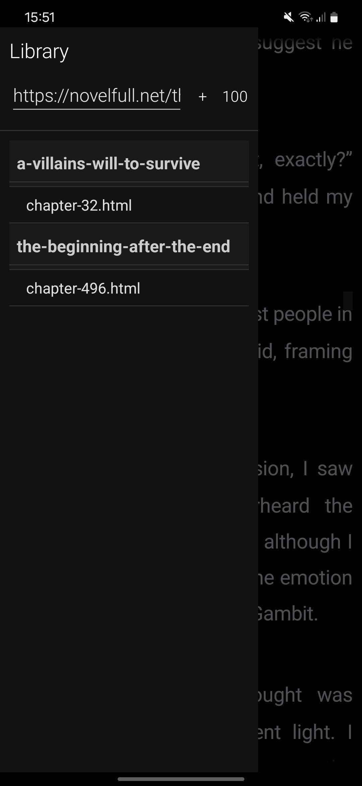

**NovelScraper** is a novel reader android app, it’s coded in Java and uses the android studio IDE. Its purpose is to permit the reading of novels from the web, without relying on a browser or from normal reading apps that don’t include everything.

- URL Scraping, parsing and styling (online and offline) with support for images
- PDF parsing and styling
- Loads next chapter when user reaches the end of the current chapter
- Downloads 100 next chapters for offline reading
- Bionic reading*
- Library of weburls and pdfs grouped by names
- User-friendly interface for easy navigation

---

### Installation

Simply download and install the release apk.




---

* Bionic reading is implemented but currently in testing to enable it, one needs to uncomment the line in the MainActivity.java file:
```java
//            String bionicText = applyBionicReading(paragraph);
//            textView.setText(Html.fromHtml(bionicText, Html.FROM_HTML_MODE_LEGACY));
            textView.setText(Html.fromHtml(paragraph, Html.FROM_HTML_MODE_LEGACY));
```
* Bionic reading is a method of reading that aims to improve reading speed and comprehension by highlighting the most important parts of words, allowing readers to quickly grasp the meaning of sentences without having to read every single letter.
